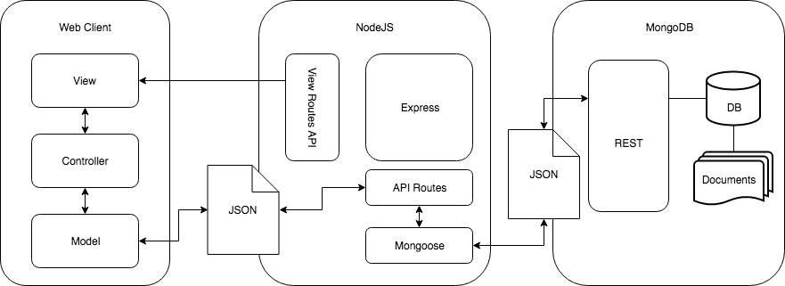
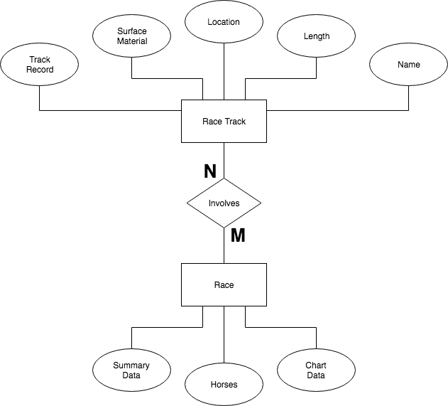

# 6.0 Software Design Description
### **Outline of Software Development Plan**
### [6.1 Introduction](#61-introduction-1)
#### - [6.1.1 System Objectives](#611-system-objectives)
#### - [6.1.2 Hardware, Software, and Human Interfaces](#612-hardware,-software,-and-human-interfaces)
### [6.2 Architectural Design](#62-architectural-design-1)
#### - [6.2.1 Major Software Components](#621-major-software-components)
#### - [6.2.2 Major Software Interactions](#622-major-software-interactions)
#### - [6.2.3 Architectural Design Diagrams](#623-architectural-design-diagrams)
### [6.3 CSC and CSU Descriptions](#63-csc-and-csu-descriptions-1)
#### - [6.3.1 Class Descriptions](#631-class-descriptions)
#### - [6.3.2 Detailed Interface Descriptions](#632-detailed-interface-descriptions)
#### - [6.3.3 Detailed Data Structure Descriptions](#633-detailed-data-structure-descriptions)
#### - [6.3.4 Detailed Design Diagrams](#634-detailed-design-diagrams)
### [6.4 Database Design and Description](#64-database-design-and-description)
#### - [6.4.1 Database Design ER Diagram](#641-database-design-er-diagram)
#### - [6.4.2 Database Access](#642-database-access)
#### - [6.4.3 Database Security](#643-database-security)

## 6.1 Introduction
This document presents the architecture and detailed design for the software for Generacer. Generacer is a web application built to parse result data from previous horse races and produce renderings to represent those races as accurately as possible.

### 6.1.1 System Objectives
This system will be made to allow users to easily enter the copious amounts of data that comes with each race and watch and interact with the displays of the race.

### 6.1.2 Hardware, Software, and Human Interfaces

| Interface Type | Interface Description |
|----------------|-----------------------|
| Human Interface | Mouse and Keyboard |
| Human Interface | Monitor |
| Hardware Interface | Wireless Networking |
| Software Interface | Database |
| Software Interface | Server |

## 6.2 Architectural Design
The Generacer system architecture is comprised of a web browser-based user interface (front-end), and a server (back-end). The front-end consists of various webpages which allows users to input data and watch renderings of races. The server back-end will handle the grunt of the data parsing and actual race rendering and the database will store the data from previously entered tracks and races.

### 6.2.1 Major Software Components
- Front-end CSC
    -  Home page
    -  About page
    -  Help page
    -  Horse Racing Knowledge page
    -  Input page
        -  Manual input module
        -  Track lookup module
        -  Race lookup module
    -  Render page
- Server CSC
    - Queries
        - Create / Get Race Track Data
        - Create / Get Race Data
    - Routes
        - API Routes
        - View Routes
- Database CSC
    - Collections
        - Race Tracks
        - Races

### 6.2.2 Major Software Interactions
The three main software components for Generacer are the web client, server, and database. When a user navigates to Generacer URL endpoints, the server responds with an html page for the web client to render. Through the user interface, the web client is able to create, read, update, and delete data by making jQuery AJAX calls to the RESTful API provided by the server. The server uses mongoose object relational mapping to perform data validation of the payload and establishes a connection to the MongoDB database. The database returns data and a status code, which the server then parses before sending the data back to the web cient.

### 6.2.3 Architectural Design Diagram

##### Figure 1: Generacer Software Architectural Diagram

## 6.3 CSC and CSU Descriptions
The Generacer CSCI is comprise of three primary CSC's: the Front-end CSC, the Server CSC, and the Database CSC. The Generacer Front-end CSC handles interactiosn between the end user and the Server CSC. The Generacer Server CSC provides an interface between the Front-end CSC and the Database CSC. The Generacer Database CSC stores all of Generacer's data and organizes it in a useful manner.

### 6.3.1 Class Descriptions
The responsibilities and functionalities of the Generacer CSC's are described in detail below.

#### 6.3.1.1 Front-end CSC
The Generacer Front-end CSC is built to simplify and make efficient the entry of what seems to be an intimidating amount of data. The layout of the front-end is such that allows users to easily navigate the site to get to the race renderings as quickly as possible.

#### 6.3.1.2 Server CSC
Ther Server CSC is the main form of communication between the Front-end and Database. Queries are submitted through, validated, and processed by the Server, which responds with the appropriate requested data (granted validation checks pass and the data exists in the Database).

#### 6.3.1.3 Database CSC
The Database CSC consists of the MongoDB database, an open-source, document database designed for ease of development and scaling. It was chosen as the underlying database technology for Generacer because of its high performance and scalability (both vertical and horizontal). The Database CSC contains MongoDB collections which persist information about cases, suspects, users, and victims, which are stored as documents.

### 6.3.2 Detailed Interface Descriptions
The following subsections describe how the Generacer CSC's interact in order to maximize the funcionality of the application.

#### 6.3.2.1 Front-end/Server Interface
The Frontend CSC interfaces with the Server CSC at several points throughout each possible action.
When the end user submits the race data on the Input page, the Front-end CSC submits the inputted collection of data to the Server CSC. After checking for issues with the Database CSC, the Server CSC sends an error or success message back to the Front-end CSC for visual display.

#### 6.3.2.2 Server/Database Interface
The Server CSC interfaces with the Database CSC through a MongoDB connection facilitated by the Mongoose library. The Mongoose library facilitates object modeling, validation, and business logic for MongoDB. The Server CSC includes Mongoose Models, for race tracks and races. The Server CSC includes REST API controllers which provide a structured interface to the Database CSC to create, read, update, or delete (CRUD) entries in the race track and races database. The REST API controllers will filter and forward any errors returned from the Database CSC to the Front-end CSC, if there are any.

### 6.3.3 Detailed Data Structure Descriptions
The underlying data structure used for the Front-end/Server and Server/Database interfaces is JSON (JavaScript Object Notation). JSON is a syntax for stroing and exchanging data that is lightweight and easy for humans to read and write. As a text format that is language independent, data stored as JSON can be easily exchanged between the server, client, and database. JavaScript objects can easily be converted into JSON, and vice versa.
JSON data is written as key/value pairs. JSON keys must be strings, and JSON values must be a string, number, object (JSON object), array, boolean, or null.
A JavaScript object can be converted to JSON via the JSON.stringify() method, and JSON can be converted to JavaScript objects via the JSON.parse() method.

## 6.4 Database Design and Description
The Race Track Database will be implemented in MongoDB, using Mongoose as an object relational model tool for Node.js. The potential users will be users of the Generacer web application, which will provide a web front-end for this database. The full database for Generacer consists of the Race Track Database and the Race Database.
The data that will be stored in the Race Track Database will be the basic data related to each race track: its location, length, surface material, name, and track record.
The data that will be stored in the Races Database will be the data of races that have already been rendered and stored for future viewing purposes.

### 6.4.1 Database Design ER Diagram

### 6.4.2 Database Access
Users of Generacer will interact with the database through the Input Data and Data Lookup functionalities. Both of these functionalities are displayed in their respective user interface modules. When the user completes and input data form, the client's browser will run JavaScript that makes a POST `http` request to the server where the database is hosted. When the user submits a request to lookup track or previous race data the client's browser will run JavaScript that makes a GET `http` request to the server.

### 6.4.3 Database Security
Generacer's database is open to input from all users. The only security implemented is data validation upon entry to ensure appropriate data is being entered for race tracks and races.
